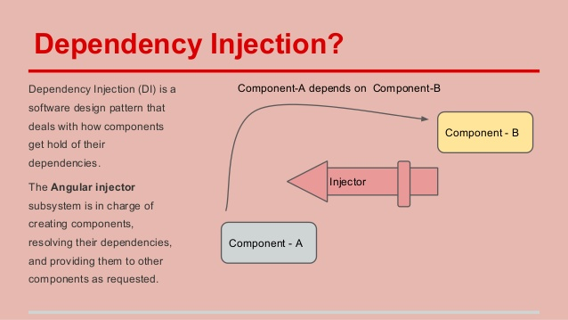

# MentorMate Angularjs 101 - Day 01

> “The secret to building large apps is never build large apps. Break your applications into small pieces. Then, assemble those testable, bite-sized pieces into your big application” - Justin Meyer Author JavaScriptMVC

### Introduction

##### Key Features of AngularJS
 - Declaritive HTML approach
 - Easy Data Binding: One way and Two way Data Binding
 - Reusable Components
 - MVC/MVVM Design Pattern
 - Dependency Injection
 - End to end Integration Testing / Unit Testing
 - Routing
 - Templating



[*Image source*](http://image.slidesharecdn.com/allaboutangularjs-final-150516180153-lva1-app6891/95/angularjs-for-beginners-90-discount-coupon-httpswwwudemycomangularjsforbeginnerscouponcodeslideshare-36-638.jpg?cb=1431799841)


[*Image source*](https://i-msdn.sec.s-msft.com/dynimg/IC448690.png)

##### Data Binding


[*Image source*](https://docs.angularjs.org/guide/databinding)


[*Image source*](https://docs.angularjs.org/guide/databinding)

##### Key Components of an Angular Application
 - Dependency Injection
 - Controllers
 - Models
 - Services
 - Directives
 - Modules
 - Filters
 - Factories
 - Scopes
 - Templates
 - Routes 
 - Animations 
 - Data Binding 
 - Testing 

##### John Papa


[Style Guide](https://github.com/johnpapa/angular-styleguide/blob/master/a1/README.md)

### Bootstrapping

```html
<html ng-app="mentormate">
```

### John Papa: controllerAs Controller Syntax

> Use the `controllerAs` syntax over the `classic controller with $scope` syntax.

> The `controllerAs` syntax uses `this` inside controllers which gets bound to `$scope`. 

> Why?: `controllerAs` is syntactic sugar over `$scope`. You can still bind to the View and still access `$scope` methods.

> Why?: Helps avoid the temptation of using `$scope` methods inside a controller when it may otherwise be better to avoid them or move the method to a factory, and reference them from the controller. Consider using `$scope` in a controller only when needed. For example when publishing and subscribing events using `$emit`, `$broadcast`, or `$on`.

```javascript
/* avoid */
function CustomerController($scope) {
	$scope.name = {};
	$scope.sendMessage = function() { };
}
```

```javascript
/* recommended - but see next section */
function CustomerController() {
	this.name = {};
	this.sendMessage = function() { };
}
```

### John Papa: controllerAs with vm

> Use a capture variable for `this` when using the `controllerAs` syntax. Choose a consistent variable name such as `vm`, which stands for `ViewModel`.

> Why?: The `this` keyword is contextual and when used within a function inside a controller may change its context. Capturing the context of `this` avoids encountering this problem.

```javascript
/* avoid */
function CustomerController() {
	this.name = {};
	this.sendMessage = function() { };
}
```

```javascript
/* recommended */
function CustomerController() {
	var vm = this;
	vm.name = {};
	vm.sendMessage = function() { };
}
```

### Data binding: Interpolation

```html
<h3>{{ vm.story.name }}</h3>
```

### Data binding: One way

```html
<h3 ng-bind="vm.story.name"></h3>
```

[Demo](https://plnkr.co/edit/fI6iPCLae8QIdct10jIy?p=preview)

### Data binding: Event binding

```html
<button ng-click="vm.log('click')" ng-blur="vm.log('blur')">OK</button>
```

### Data binding: Two way	

```html
<input ng-model="vm.story.name"/>
```

[Demo](https://plnkr.co/edit/IhN5w2nqfyvgKG1XQaZO?p=info)

### Modules

> “The secret to building large apps is never build large apps. Break your applications into small pieces. Then, assemble those testable, bite-sized pieces into your big application” - Justin Meyer Author JavaScriptMVC

```html
<body ng-controller="StoryController as vm">
	<h3>{{ vm.story.name }}</h3>
	<h3 ng-bind="vm.story.name"></h3>
</body>
```

```javascript
(function () {
  angular
    .module('app')
    .controller('StoryController', StoryController);

		// Dependency Injection
		StoryController.$inject = ['StoryService'];

		function StoryController() {
			var vm = this;
			vm.story = {
				'id': 100,
				'name': 'The Force Awekens'
			}

			vm.stories = StoryService.getStories();
		}
})();
```

[Demo](https://plnkr.co/edit/FbJSgeTjk3F1MQCqsqLe?p=info)
