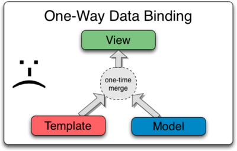

# MentorMate Angularjs 101 - Day 01

> “The secret to building large apps is never build large apps. Break your applications into small pieces. Then, assemble those testable, bite-sized pieces into your big application” - Justin Meyer Author JavaScriptMVC

### Introduction

##### Key Features of AngularJS
 - Declaritive HTML approach
 - Easy Data Binding: One way and Two way Data Binding
 - Reusable Components
 - MVC/MVVM Design Pattern
 - Dependency Injection
 - End to end Integration Testing / Unit Testing
 - Routing
 - Templating


[*Image source*](http://image.slidesharecdn.com/allaboutangularjs-final-150516180153-lva1-app6891/95/angularjs-for-beginners-90-discount-coupon-httpswwwudemycomangularjsforbeginnerscouponcodeslideshare-36-638.jpg?cb=1431799841)


[*Image source*](https://i-msdn.sec.s-msft.com/dynimg/IC448690.png)

##### Data Binding



[*Image source*](https://docs.angularjs.org/guide/databinding)


[*Image source*](https://docs.angularjs.org/guide/databinding)

##### Key Components of an Angular Application
 - Dependency Injection
 - Controllers
 - Models
 - Services
 - Directives
 - Modules
 - Filters
 - Factories
 - Scopes
 - Templates
 - Routes 
 - Animations 
 - Data Binding 
 - Testing 

##### John Papa


[Style Guide](https://github.com/johnpapa/angular-styleguide/blob/master/a1/README.md)

### Bootstrapping

```javascript
<html ng-app="html">
```

### Data binding: Interpolation

```javascript
<h3>{{ vm.story.name }}</h3>
```

### Data binding: One way

```javascript
<h3 ng-bind="vm.story.name></h3>
```

[Demo](https://plnkr.co/edit/fI6iPCLae8QIdct10jIy?p=preview)

### Data binding: Event binding

```javascript
<button
  ng-click="vm.log('click')"
	ng-blur="vm.log('blur')">OK</button>
```

[Demo](https://plnkr.co/edit/fI6iPCLae8QIdct10jIy?p=preview)

### Data binding: Two way	

```javascript
<input ng-model="vm.story.name"/>
```

[Demo](https://plnkr.co/edit/fI6iPCLae8QIdct10jIy?p=preview)
